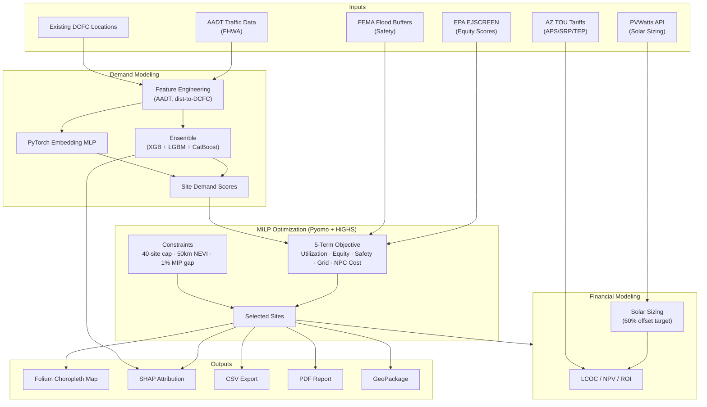

# Elektraz - Arizona Solar EV Charging Station Optimization

**Statewide EV charging siting optimization** — a Streamlit decision-support platform combining ensemble ML demand forecasting, MILP site selection, equity/safety scoring, solar sizing, and full financial modeling across Arizona.

> 🥉 **3rd Place — IISE X 2025**

---

## Overview

Elektraz is an end-to-end pipeline for deciding *where* to build EV charging infrastructure across a state. It integrates five independently complex domains — traffic-based demand modeling, mixed-integer optimization, environmental justice scoring, grid/solar financials, and interactive stakeholder reporting — into a single coherent 8-page Streamlit workflow.

The core insight: siting a DCFC network is not just a cost minimization problem. Elektraz formulates it as a **five-term MILP objective** balancing utilization, equity, safety, grid impact, and net present cost — each with empirically calibrated weights — then explains every model decision with SHAP for regulatory-grade auditability.

---

## Live Demo

**Live:** **[elektraz-5wkjmdcnzbn9c7t7cuyjza.streamlit.app](https://elektraz-5wkjmdcnzbn9c7t7cuyjza.streamlit.app)**

**Dashboard — 2252 candidate sites, 25 selected, quick map of Arizona**


**ML Insights — SHAP feature importance by model**


**Configuration — five objective weight sliders for live scenario tuning**


**Data Management — model retrain and pipeline refresh controls**


---

## Highlights

- **Multi-model demand forecasting** — XGBoost, LightGBM, CatBoost ensemble + PyTorch embedding MLP, trained on AADT traffic counts and distance-to-existing-DCFC coverage features, fed directly into the optimizer as site demand scores.
- **Pyomo + HiGHS MILP with five-term objective** — Simultaneously optimizes utilization (1.0), equity (0.25), safety (0.5), grid impact (0.3), and NPC cost (0.8) in one formulation; enforces 40-site cap, 50 km NEVI spacing, and 1% MIP gap.
- **Equity & safety data integration** — EPA EJSCREEN scores weight underserved-community coverage; FEMA flood buffers exclude or deprioritize hazard-exposed candidates.
- **Per-site financial modeling** — Arizona APS/SRP/TEP TOU tariffs, PVWatts solar sizing toward a 60% demand offset target, full LCOC/NPV/ROI workflows per candidate station.
- **SHAP explainability** — TreeExplainer on each ensemble model produces feature-level attribution for every siting decision, enabling regulatory audits.
- **Stakeholder-ready outputs** — Interactive folium choropleth maps, downloadable CSV, georeferenced GeoPackage, and auto-generated PDF reports (fpdf2).

---

## Use Cases

| Use Case | User | Outcome |
|----------|------|---------|
| Statewide network planning | State DOT / utility | Ranked candidate list with NEVI-compliant spacing and budget constraints |
| Equity-weighted deployment | Policymaker / MPO | Sites prioritized by EJSCREEN underserved-community scores |
| Financial due diligence | Project developer | Per-site LCOC, NPV, ROI with solar offset and TOU tariff modeling |
| Scenario comparison | Stakeholder analyst | Adjust objective weights via sliders, re-run optimizer, compare outputs |
| Regulatory audit | Permitting agency | SHAP feature attribution explaining each model's site ranking |

---

## Features

### Demand Modeling
- Traffic feature engineering from AADT (Annual Average Daily Traffic) and distance-to-nearest-DCFC
- Ensemble: XGBoost + LightGBM + CatBoost with stacked predictions
- Deep model: PyTorch embedding MLP for categorical site features
- Model outputs used directly as demand scores in the MILP objective

### MILP Site Selection (Pyomo + HiGHS)
- Five-term weighted objective: utilization, equity, safety, grid impact, NPC cost
- Constraints: 40-site maximum, 50 km NEVI corridor spacing, 1% MIP optimality gap
- Equity term: EPA EJSCREEN environmental justice scores
- Safety term: FEMA flood hazard buffer exclusion zones
- Candidate URLs fed from demand model scores

### Financial Modeling
- Utility rate inputs: Arizona APS, SRP, and TEP time-of-use tariffs
- Solar sizing: PVWatts API integration, per-site sizing toward 60% demand offset
- Outputs: Levelized Cost of Charging (LCOC), Net Present Value (NPV), Return on Investment (ROI)
- Full capital and operating cost breakdown per candidate station

### Explainability & Visualization
- SHAP TreeExplainer on each ensemble model for feature-level decision attribution
- Folium choropleth maps for interactive spatial review of ranked candidates
- Objective weight sliders (8-page Streamlit workflow) for real-time scenario testing

### Exports
- CSV: Full candidate rankings with scores and financials
- GeoPackage: Georeferenced site data for GIS workflows (geopandas)
- PDF: Auto-generated stakeholder report (fpdf2)

---

## Tech Stack

| Layer | Technology | Purpose |
|-------|------------|---------|
| App framework | Streamlit | 8-page interactive stakeholder workflow |
| Optimization | Pyomo + HiGHS | MILP formulation and solver |
| ML ensemble | XGBoost, LightGBM, CatBoost | Demand score prediction |
| Deep learning | PyTorch (Embedding MLP) | Categorical feature demand modeling |
| Explainability | SHAP (TreeExplainer) | Per-model, per-site feature attribution |
| Geospatial | Geopandas, Folium | Choropleth siting maps, GeoPackage export |
| Solar sizing | PVWatts API | Per-site solar capacity estimation |
| Equity data | EPA EJSCREEN | Environmental justice scoring |
| Hazard data | FEMA flood buffers | Safety constraint for candidate filtering |
| Financial modeling | Custom Python | LCOC, NPV, ROI, TOU tariff integration |
| PDF export | fpdf2 | Automated stakeholder report generation |
| Traffic data | AADT (FHWA) | Primary demand feature |

---

## Architecture



---

## How It Works

1. **Feature engineering** — AADT counts and straight-line distance to the nearest existing DCFC station are computed for each candidate site, forming the primary demand signals.

2. **Demand modeling** — XGBoost, LightGBM, and CatBoost are trained as an ensemble; a PyTorch embedding MLP handles categorical site features. Their outputs are averaged into a single demand score per candidate.

3. **MILP formulation** — Pyomo encodes a five-term objective. Demand scores drive the utilization term. EJSCREEN scores enter the equity term. FEMA flood zones constrain the safety term. Grid impact and NPC cost round out the formulation. HiGHS solves to within 1% of optimality.

4. **Financial analysis** — Each selected site is sized for solar using PVWatts (targeting 60% demand offset). Arizona utility TOU tariffs (APS, SRP, TEP) set the energy price basis. LCOC, NPV, and ROI are computed per station.

5. **Explainability** — SHAP TreeExplainer runs on each ensemble model, producing feature-importance breakdowns that justify individual site selections in audit-ready terms.

6. **Stakeholder workflow** — An 8-page Streamlit app lets analysts adjust objective weights via sliders, view ranked candidates on an interactive folium map, and export results as CSV, GeoPackage, or PDF.

---

## Setup

### Prerequisites
- Python 3.10+
- HiGHS solver (installed automatically with `highspy` or separately)

### Install

```bash
git clone <repo-url>
cd elektraz
pip install -r requirements.txt
```

### Run

```bash
streamlit run app/app.py
```

Open `http://localhost:8501` in your browser.

---

## Objective Weight Calibration

The five-term MILP objective uses empirically calibrated weights:

| Term | Weight | Data Source |
|------|--------|-------------|
| Utilization | 1.0 | Demand model scores (AADT + DCFC distance) |
| Equity | 0.25 | EPA EJSCREEN environmental justice percentiles |
| Safety | 0.5 | FEMA flood hazard buffer exclusion |
| Grid impact | 0.3 | Estimated per-site grid load |
| NPC cost | 0.8 | Capital + operating cost, discounted |

These are exposed as sliders in the Streamlit interface, allowing scenario analysis without code changes.

---

## Key Decisions

| Decision | Rationale | Tradeoff |
|----------|-----------|----------|
| Ensemble + MLP demand models | Ensemble handles tabular signals well; MLP captures categorical embedding interactions | Added training complexity over a single model |
| Pyomo + HiGHS over commercial solvers | HiGHS is open-source, fast for MILP, and deployable without licensing | Less mature ecosystem than Gurobi/CPLEX |
| Five-term objective vs. lexicographic priority | Single weighted objective enables smooth tradeoff exploration via sliders | Weight tuning requires domain judgment |
| SHAP TreeExplainer per model | Regulatory contexts require per-decision justification; SHAP is model-native for tree ensembles | Adds compute; not applicable to MLP without approximation |
| NEVI 50 km spacing constraint | Aligns with federal NEVI Formula Program corridor requirements | May exclude high-demand urban clusters |
| PVWatts for solar sizing | API provides location-accurate irradiance without manual weather data | Requires internet access at runtime |

---

## Innovation / Notable Work

**Unified multi-objective MILP**: Most EV siting work optimizes cost alone or treats equity as a post-hoc filter. Elektraz embeds utilization, equity, safety, grid, and cost simultaneously in a single Pyomo formulation — with weights the user can tune live — so no objective is silently discarded.

**Demand score pipeline into optimization**: Rather than using raw traffic counts as a proxy, the ensemble and MLP predictions serve as the demand coefficient in the MILP utilization term. This means the optimizer reasons about learned demand patterns, not just observed traffic.

**Regulatory-grade explainability**: SHAP TreeExplainer runs on each ensemble model independently, so a permitting agency can audit why a specific site ranked above another by inspecting feature-level attributions — not just inspect the final score.

**Equity + hazard data integration**: EPA EJSCREEN percentiles and FEMA flood buffers are first-class inputs to the optimizer, not post-processing filters. A flood-prone site is penalized in the objective; a site in an underserved census tract is rewarded — both at solve time.

---

## Potential Metrics to Track

| Metric | Why It Matters |
|--------|---------------|
| MILP solve time vs. candidate count | Confirms scalability as dataset grows beyond Arizona |
| Demand model RMSE / MAE on held-out sites | Validates that AADT features generalize to new geographies |
| Equity coverage improvement | % of EJSCREEN-flagged tracts within N km of a selected site vs. baseline |
| Solar offset achieved | Actual vs. 60% target across selected portfolio |
| PDF / GeoPackage export adoption | Proxy for stakeholder engagement with the tool |
